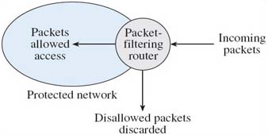
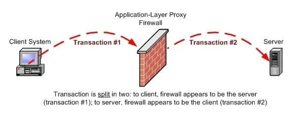
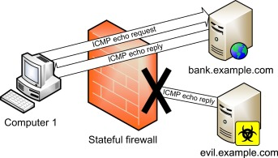

# Firewall  

A firewall is a system that provides network security by enforcing access control policy between private LAN and public internet. A Firewall provides a layer of security preventing any hacker from accessing important data. A firewall can be software, hardware or both.  

### Purpose of Firewall :
1. It blocks incoming data that might contain malicious malware containing a hacker attack.
2. It hides the information of the network by imposing itself that all the outgoing traffic generated by the firewall rather than the network - This is called network address translation.

### Types Of Firewall :
There are three basic types of firewalls that are used by companies to protect their data & devices to keep destructive elements out of network.  
1. Packet filter firewalls
2. Application proxy servers
3. Stateful firewalls

#### Packet filter firewalls :  
Every computer on a network has an address commonly referred to as an IP address. A packet filter firewall checks the address of incoming traffic and turns away anything that doesn’t match the list of trusted addresses.  
  

#### Application-Level Proxy Server:
An application-level proxy server examines the application used for each individual IP packet to verify its authenticity. It proxies provide security by hiding internal network addresses from the outside world.

#### Stateful Firewall:   
It examines all parts of the IP packet to determine whether to accept or reject the requested communication. Stateful inspection firewalls are considered more secure than packet filtering firewalls. Stateful inspection firewalls process application layer data. Therefore, they are able to take a deeper look into the transaction to understand what is going on.   

### Software based Firewalls:  

* A software firewall is a software based solution installed on individual computers on one's network to safegaurd against any vulnerabilities.   
* This firewall acts as second line of defence from online attacks any malcious programm try to access one's network.  
* Use of anti-virus It's easier to install software as compared to hardware firewalls, due to ease of customization, users can have better control over it's functionalities. 

### Hardware based Firewalls:  
* It's a physical device (router) installed between local computer network and the public internet.
* A single firewall can protect whole computer network zone, Less vulnerable to attacks.
* Hardware firewall is difficult to install and takes up physical space which involves wiring.

### Conlusion:
* Software based firewall are best suited for small organization having low risk environment like florist shop using packet filetring.
* Hardware based firewall are best suited for large organization having High risk environment like hospital where data needs to be protected should install Hybrid gateway - combination of both packet filetring and application gateways.  

### Reference
1. https://www.digitalocean.com/community/tutorials/what-is-a-firewall-and-how-does-it-work
2. https://www.cisco.com/c/en_in/products/security/firewalls/what-is-a-firewall.html
3. https://www.youtube.com/playlist?list=PLBbU9-SUUCwV7Dpk7GI8QDLu3w54TNAA6
4. https://www.researchgate.net/.